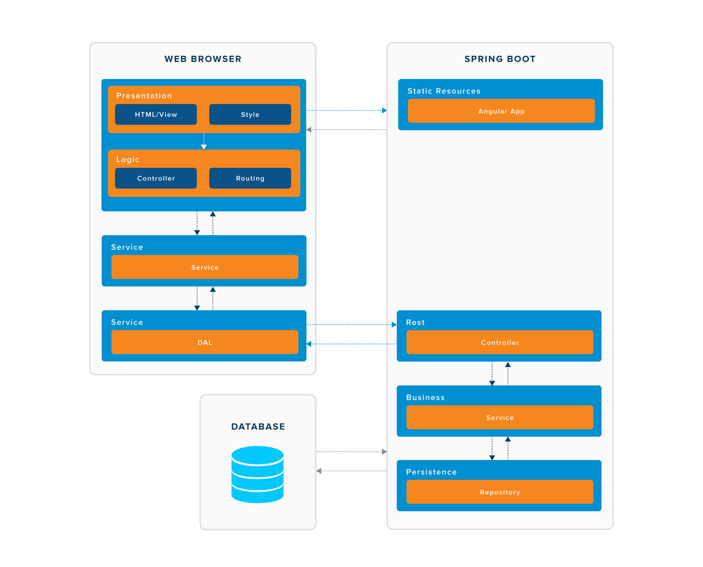

Introduction 
-----------
This is a simple trainer management system that can be used as a reference architecture to build a full-stack application. This system is built with the following technologies:

-   [Spring boot](https://spring.io/projects/spring-boot) for server side web pages and services

-   [AngularJS](https://angularjs.org/) for client side rich user interfaces

-   [MySQL](https://www.mysql.com/) for relational data

-   [Docker](https://www.docker.com/) for a standard run-time environment

Prerequisite
-----
Prior to running this application we need to setup our windows environments by following these steps:

Step 1:
Open up a command prompt as an administrator and install the Windows package manager using the following command:
```
@"%SystemRoot%\System32\WindowsPowerShell\v1.0\powershell.exe" -NoProfile -InputFormat None -ExecutionPolicy Bypass -Command "iex ((New-Object System.Net.WebClient).DownloadString('https://chocolatey.org/install.ps1'))" && SET "PATH=%PATH%;%ALLUSERSPROFILE%\chocolatey\bin"
```
Step 2:
Using the Windows package manager install java jdk, maven and docker toolbox using the following commands:
```
choco install -y jdk8 maven virtualbox
choco install -y docker-toolbox -ia /TASKS="desktopicon,modifypath,upgradevm"
```
Step 3:
Close the current command prompt and open the Docker Quickstart Terminal (icon on is on your desktop)

Step 4:
Using the Docker Quickstart Terminal forward port 8080 on the docker virtualbox machine using VBoxManage.exe by executing the following command:
```
/c/Program\ Files/Oracle/VirtualBox/VBoxManage controlvm "default" natpf1 "tracker-docker,tcp,,8080,,8080"
```
Project Management
---------------
This project used an Agile methodology using the follow example task board: https://trello.com/b/lu4XPoxP/trainer-app

Architecture
---------------
The following diagram shows the high level reference architecture for the application: 

Running the application
-----
Step 1:
Make a directory for your work and clone the tracker-docker project using the following command:
```
mkdir -p ~/projects && cd $_
git clone https://github.com/scrappy1987/tracker-docker && cd tracker-docker
```
Step 2:
Build a docker image of the tracker-docker project using the following command:
```
mvn clean package docker:build
```
Step 3:
Run a mysql db in a docker container using the following command:
```
docker run --name trainer-mysql -e MYSQL_ROOT_PASSWORD=password -e MYSQL_DATABASE=trainer -e MYSQL_USER=trainer_user -e MYSQL_PASSWORD=trainer_pass -d mysql:5.6
```
Step 4:
Run the tracker-docker image that was built in step 2 using the following command:
```
docker run -p 8080:8080 --name trainer-app --link trainer-mysql:mysql -d trainer/trainer-tracker
```
Step 5:
Access the applicaton by accessing the following URL in the browser
```
http://localhost:8080
```
